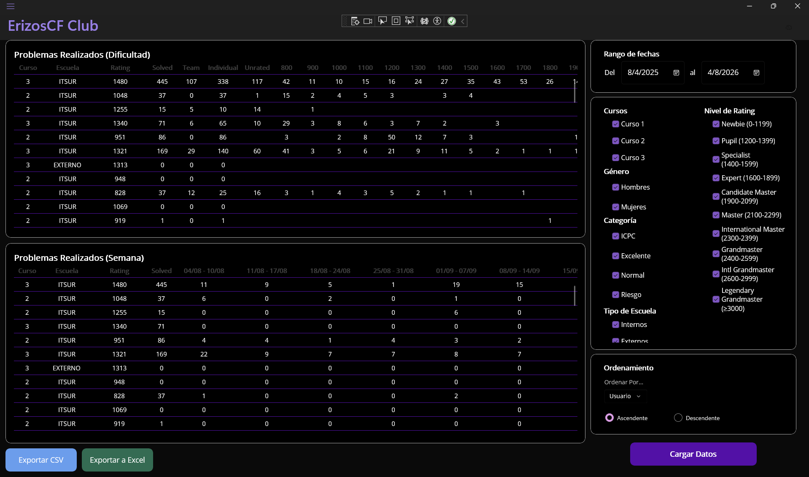
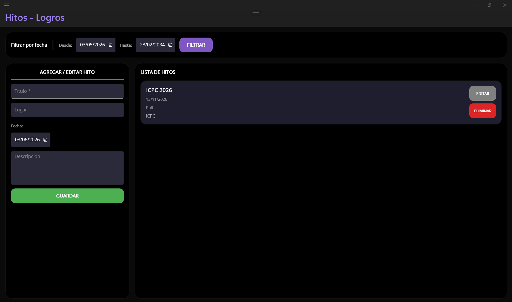
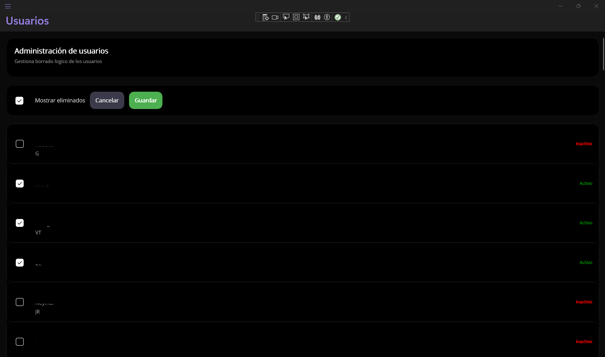
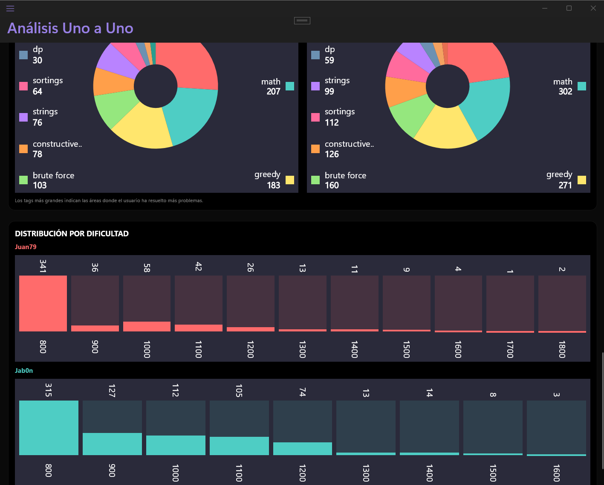
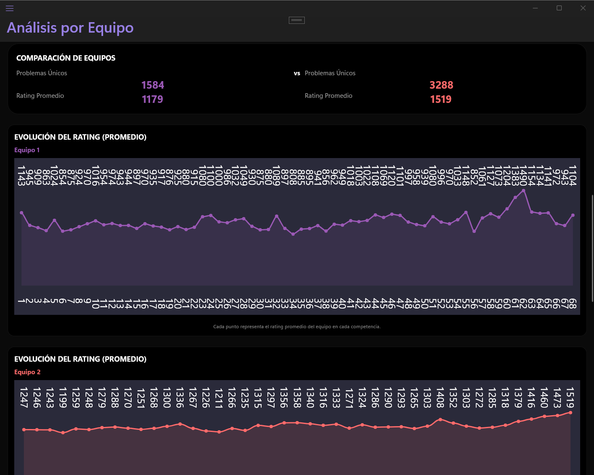

# ErizosCF
Aplicación de escritorio desarrollada en .NET MAUI que consume la API pública de Codeforces para analizar el rendimiento de estudiantes de programación competitiva. Permite gestionar usuarios, comparar métricas individuales y por equipos, y exportar reportes.
**Proyecto desarrollado para apoyar el seguimiento académico y competitivo de estudiantes pertenecientes a un club de programación competitiva.**

  

## Problema
El seguimiento del progreso de estudiantes de programación competitiva suele requerir consultar manualmente múltiples perfiles de Codeforces y consolidar información dispersa.
ErizosCF centraliza esta información, permitiendo analizar rendimiento individual y grupal mediante métricas, filtros y reportes visuales.

## Resultados
Se optimizaron procesos críticos relacionados con el análisis de datos provenientes de la API de Codeforces:

| Proceso | Tiempo original | Tiempo final | Mejora |
|----------|----------|----------|----------|
| Problemas resueltos por período | 75:36 min | 2:10 min | 97.13% |
| Reporte comparativo | 43:00 min | 2:34 min | 94.03% |
| Problemas por semana | 55:48 min | 2:10 min | 96.12% |

## Características principales
- Consumo de la API de Codeforces (user.info, user.status, user.rating).
- Obtención de perfil de usuario: rating actual, máximo, nombre, historial de competencias.
- Análisis de problemas resueltos por:
  - Dificultad (rating del problema).
  - Etiquetas temáticas (tags: greedy, dp, graphs, etc.).
  - Progreso semanal.
- Distinción entre problemas resueltos de forma individual y en equipo (mediante teamId).
- Comparación uno a uno de dos usuarios con gráficas de:
  - Evolución del rating (línea).
  - Distribución de tags (pastel).
  - Dificultad de problemas (barras).
- Comparación de dos equipos (hasta 3 integrantes cada uno) con métricas agregadas.
- Panel de administración con:
  - Lista de usuarios desde base de datos local (curso, género, estado: ICPC/Excelente/Normal/Riesgo).
  - Filtros por curso, género, rango de rating, tipo de escuela (interno/externo).
  - Ordenamiento dinámico por múltiples campos.
  - Tablas de problemas por dificultad y por semana con desplazamiento sincronizado.
- Gestión de hitos y logros del club de programación: CRUD con fechas y descripción.
- Exportación de datos a CSV y Excel.
- Almacenamiento local en MySQL, variables de entorno para conexión.

## Tecnologías

- C#
- .NET MAUI
- MySQL
- XAML
- CommunityToolkit.Mvvm
- Microcharts
- ClosedXML

## Arquitectura

- MVVM
- Consumo de API mediante HttpClient
- Persistencia en MySQL
- Exportación a CSV y Excel

## Requisitos previos
- Sistema operativo Windows, macOS o Linux (con .NET MAUI compatible).
- .NET SDK 8.0 o superior.
- MySQL con la base de datos configurada.
- Definir variables de entorno para la base de datos (o se usará un string de conexión base por defecto).

## Instalación y configuración

Clonar el repositorio:
   `git clone https://github.com/Nope79/ErizosCF_CPCI.git`
   `cd ErizosCF_CPCI`

Restaurar el paquete NuGet: 
`dotnet restore`

Configurar la base de datos MySQL:
  - Ejecutar el script erizoscf_db.sql (incluido en el repositorio) para crear las tablas usuarios, hitos, etc.
  - Ajustar la cadena de conexión en DbService.cs (por defecto usa variables de entorno erizoscf_db_server, erizoscf_db_user, etc.; si no existen, usa localhost/root/root/erizosCF).

Compilar y ejecutar:
`dotnet build`
`dotnet run`

## Capturas

| Hitos | Gestión |
|------------|------------|
|  |  |

| Individual | Equipos |
|------------|------------|
|  |  |
